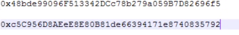
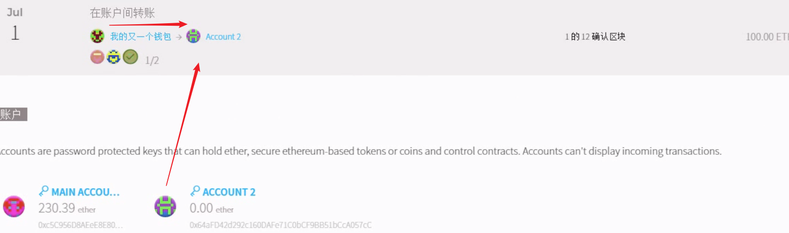

## solitidy-智能合约

[官方文档](https://solidity.readthedocs.io/en/v0.4.24/index.html)

[中文版文档](https://solidity-cn.readthedocs.io/zh/develop/)

### 概述

类似js，运行在以太坊虚拟机中

静态类型编程：指明编译类型

支持继承、和类型定义

### 开发工具

[在线编辑器](https://remix.ethereum.org)

[idea插件](https://plugins.jetbrains.com/plugin/9475-intellij-solidity)

### 环境搭建

https://github.com/ethereum/mist/releases/download/v0.11.1/Mist-win64-0-11-1.zip)

#### 问题：初始化同步失败

查看目录完整性，是否生成geth


#### 多节点私有链

两台以上虚拟机：geth节点+[mist客户端的github](https://github.com/ethereum/mist/releases)

文件64 mist.zip 最新版[Mist-win64-0-11-1.zip](https://github.com/ethereum/mist/releases/download/v0.11.1/Mist-win64-0-11-1.zip)


#### 共享文件

多台虚拟机都放Mychainas\dev下

创世区块


cmd> geth --testnet console


### 多节点私有网络-初始化

init.bat

Star.bat

启动mist客户端


互通访问

内网ip地址查看 ipconfig

####  b节点与a节点信息互通

添加到b的console


#### 挖矿


前期挖矿准备


#### 交易b->a

交易过程中需要十几个确认区块协同确认


a账户同步区块交易完成


### 多重签名钱包-模拟来自不同设备的账号


#### 选择账户钱包地址

a节点下用户2


b节点下主账户




#### 

#### 创建智能合约

b节点账户1创建合约


#### b节点下模拟新用户转账交易



#### 观察合约下钱包变化

合约钱包初始存入300

****

合约监督下转账100剩余200


b节点2账户收到100


### 编写智能合约创建代币

#### 合约框架


#### 安全的远程购买

```
pragma solidity ^0.4.22;

contract Purchase {
    uint public value;
    address public seller;
    address public buyer;
    enum State { Created, Locked, Inactive }
    State public state;

    //确保 `msg.value` 是一个偶数。
    //如果它是一个奇数，则它将被截断。
    //通过乘法检查它不是奇数。
    constructor() public payable {
        seller = msg.sender;
        value = msg.value / 2;
        require((2 * value) == msg.value, "Value has to be even.");
    }

    modifier condition(bool _condition) {
        require(_condition);
        _;
    }

    modifier onlyBuyer() {
        require(
            msg.sender == buyer,
            "Only buyer can call this."
        );
        _;
    }

    modifier onlySeller() {
        require(
            msg.sender == seller,
            "Only seller can call this."
        );
        _;
    }

    modifier inState(State _state) {
        require(
            state == _state,
            "Invalid state."
        );
        _;
    }

    event Aborted();
    event PurchaseConfirmed();
    event ItemReceived();

    ///中止购买并回收以太币。
    ///只能在合约被锁定之前由卖家调用。
    function abort()
        public
        onlySeller
        inState(State.Created)
    {
        emit Aborted();
        state = State.Inactive;
        seller.transfer(address(this).balance);
    }

    /// 买家确认购买。
    /// 交易必须包含 `2 * value` 个以太币。
    /// 以太币会被锁定，直到 confirmReceived 被调用。
    function confirmPurchase()
        public
        inState(State.Created)
        condition(msg.value == (2 * value))
        payable
    {
        emit PurchaseConfirmed();
        buyer = msg.sender;
        state = State.Locked;
    }

    /// 确认你（买家）已经收到商品。
    /// 这会释放被锁定的以太币。
    function confirmReceived()
        public
        onlyBuyer
        inState(State.Locked)
    {
        emit ItemReceived();
        // 首先修改状态很重要，否则的话，由 `transfer` 所调用的合约可以回调进这里（再次接收以太币）。
        state = State.Inactive;

        // 注意: 这实际上允许买方和卖方阻止退款 - 应该使用取回模式。
        buyer.transfer(value);
        seller.transfer(address(this).balance);
    }
}
```

### 部署合约

#### a节点部署合约代码


#### 创建合约


#### 进行合约交易

A节点主账号初始挖矿10000元移交a节点2账号500

交易后主账号剩余


交易后a节点2账号余额


由合约主账号进行交易

#### b节点查看交易的合约


主账户给b节点发送1000


查询到账


